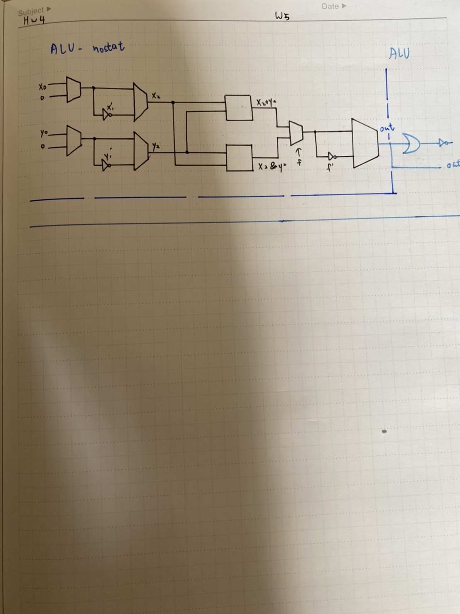

# ALU-nostat
```
CHIP ALU {
    IN  
        x[16], y[16],  // 16-bit inputs        
        zx, // zero the x input?
        nx, // negate the x input?
        zy, // zero the y input?
        ny, // negate the y input?
        f,  // compute out = x + y (if 1) or x & y (if 0)
        no; // negate the out output?

    OUT 
        out[16], // 16-bit output
        zr, // 1 if (out == 0), 0 otherwise
        ng; // 1 if (out < 0),  0 otherwise

    PARTS:
   // Put you code here:
   Mux16(a=x,b=false,sel=zx,out=x1);//zx
   Mux16(a=y,b=false,sel=zy,out=y1);//zy

   Not16(in=x1,out=nx1);
   Not16(in=y1,out=ny1);

   Mux16(a=x1,b=nx1,sel=nx,out=x2);//nx
   Mux16(a=y1,b=ny1,sel=ny,out=y2);//ny

   Add16(a=x2,b=y2,out=x2ady2); 
   And16(a=x2,b=y2,out=x2any2); 
   Mux16(a=x2any2,b=x2ady2,sel=f,out=fo);  
   Not16(in=fo,out=nf);
   Mux16(a=fo,b=nf,sel=no,out=out);
}
```
# ALU
```
CHIP ALU {
    IN  
        x[16], y[16],  // 16-bit inputs        
        zx, // zero the x input?
        nx, // negate the x input?
        zy, // zero the y input?
        ny, // negate the y input?
        f,  // compute out = x + y (if 1) or x & y (if 0)
        no; // negate the out output?

    OUT 
        out[16], // 16-bit output
        zr, // 1 if (out == 0), 0 otherwise
        ng; // 1 if (out < 0),  0 otherwise

    PARTS:
   // Put you code here:
   Mux16(a=x,b=false,sel=zx,out=x1);//zx
   Mux16(a=y,b=false,sel=zy,out=y1);//zy

   Not16(in=x1,out=nx1);
   Not16(in=y1,out=ny1);

   Mux16(a=x1,b=nx1,sel=nx,out=x2);//nx
   Mux16(a=y1,b=ny1,sel=ny,out=y2);//ny

   Add16(a=x2,b=y2,out=x2ady2); 
   And16(a=x2,b=y2,out=x2any2); 
   Mux16(a=x2any2,b=x2ady2,sel=f,out=fo);  
   Not16(in=fo,out=nf);

   Mux16(a=fo,b=nf,sel=no,out=out,out[0..7]=HIGHWAy,out[8..15]=LOWWAY,out[15]=ng);
   Or8Way(in=HIGHWAy,out=oo1);
   Or8Way(in=LOWWAY,out=oo2);
   Or(a=oo1,b=oo2,out=o2);
   Not(in=o2,out=zr);
}
```
# 