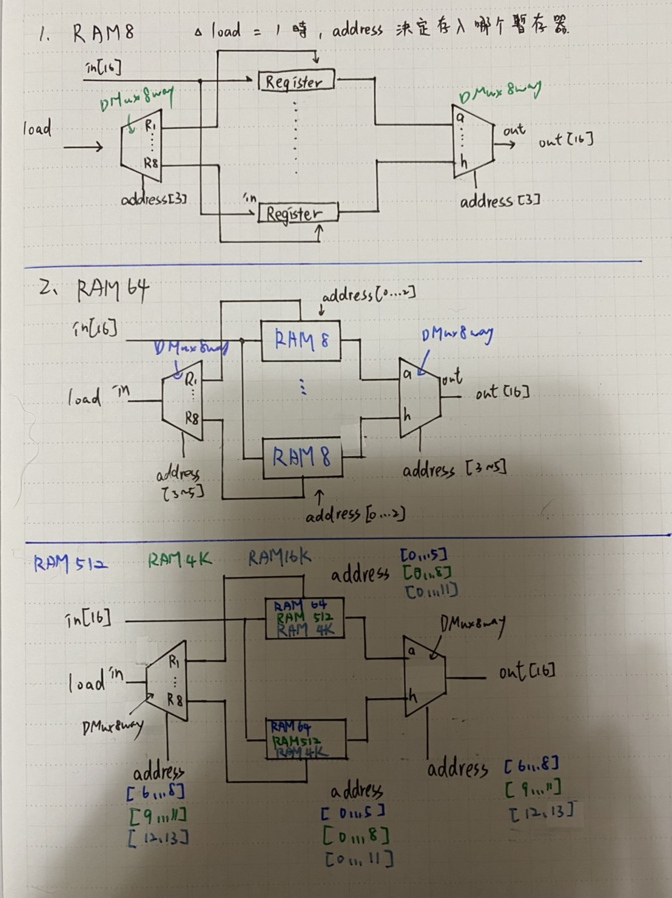

# RAM8
## code:
```
CHIP RAM8 {
    IN in[16], load, address[3];
    OUT out[16];

    PARTS:
    // Put your code here:
    DMux8Way(in=load,sel=address,a=DM0,b=DM1,c=DM2,d=DM3,e=DM4,f=DM5,g=DM6,h=DM7);
    Register(in=in,load=DM0,out=r0);
    Register(in=in,load=DM1,out=r1);
    Register(in=in,load=DM2,out=r2);
    Register(in=in,load=DM3,out=r3);
    Register(in=in,load=DM4,out=r4);
    Register(in=in,load=DM5,out=r5);
    Register(in=in,load=DM6,out=r6);
    Register(in=in,load=DM7,out=r7);
    Mux8Way16(a=r0,b=r1,c=r2,d=r3,e=r4,f=r5,g=r6,h=r7,sel=address,out=out);
}
```
# RAM64
## code:
```
CHIP RAM64 {
    IN in[16], load, address[6];
    OUT out[16];

    PARTS:
    // Put your code here:
    DMux8Way(in=load,sel=address[3..5],a=DM0,b=DM1,c=DM2,d=DM3,e=DM4,f=DM5,g=DM6,h=DM7);
    RAM8(in=in,load=DM0,address=address[0..2],out=r0);
    RAM8(in=in,load=DM1,address=address[0..2],out=r1);
    RAM8(in=in,load=DM2,address=address[0..2],out=r2);
    RAM8(in=in,load=DM3,address=address[0..2],out=r3);
    RAM8(in=in,load=DM4,address=address[0..2],out=r4);
    RAM8(in=in,load=DM5,address=address[0..2],out=r5);
    RAM8(in=in,load=DM6,address=address[0..2],out=r6);
    RAM8(in=in,load=DM7,address=address[0..2],out=r7);
    Mux8Way16(a=r0,b=r1,c=r2,d=r3,e=r4,f=r5,g=r6,h=r7,sel=address[3..5],out=out);
}
```
# RAM512
## code:
```
CHIP RAM512 {
    IN in[16], load, address[9];
    OUT out[16];

    PARTS:
    // Put your code here:
    DMux8Way(in=load,sel=address[6..8],a=DM0,b=DM1,c=DM2,d=DM3,e=DM4,f=DM5,g=DM6,h=DM7);
    RAM64(in=in,load=DM0,address=address[0..5],out=r0);
    RAM64(in=in,load=DM1,address=address[0..5],out=r1);
    RAM64(in=in,load=DM2,address=address[0..5],out=r2);
    RAM64(in=in,load=DM3,address=address[0..5],out=r3);
    RAM64(in=in,load=DM4,address=address[0..5],out=r4);
    RAM64(in=in,load=DM5,address=address[0..5],out=r5);
    RAM64(in=in,load=DM6,address=address[0..5],out=r6);
    RAM64(in=in,load=DM7,address=address[0..5],out=r7);
    Mux8Way16(a=r0,b=r1,c=r2,d=r3,e=r4,f=r5,g=r6,h=r7,sel=address[6..8],out=out);
}
```
# RAM4K
## code:
```
CHIP RAM4K {
    IN in[16], load, address[12];
    OUT out[16];

    PARTS:
    // Put your code here:
    DMux8Way(in=load,sel=address[9..11],a=DM0,b=DM1,c=DM2,d=DM3,e=DM4,f=DM5,g=DM6,h=DM7);
    RAM512(in=in,load=DM0,address=address[0..8],out=r0);
    RAM512(in=in,load=DM1,address=address[0..8],out=r1);
    RAM512(in=in,load=DM2,address=address[0..8],out=r2);
    RAM512(in=in,load=DM3,address=address[0..8],out=r3);
    RAM512(in=in,load=DM4,address=address[0..8],out=r4);
    RAM512(in=in,load=DM5,address=address[0..8],out=r5);
    RAM512(in=in,load=DM6,address=address[0..8],out=r6);
    RAM512(in=in,load=DM7,address=address[0..8],out=r7);
    Mux8Way16(a=r0,b=r1,c=r2,d=r3,e=r4,f=r5,g=r6,h=r7,sel=address[9..11],out=out);
}
```
# RAM16K
## code:
```
CHIP RAM16K {
    IN in[16], load, address[14];
    OUT out[16];

    PARTS:
    // Put your code here:
    DMux4Way(in=load,sel=address[12..13],a=DM0,b=DM1,c=DM2,d=DM3);
    RAM4K(in=in,load=DM0,address=address[0..11],out=r0);
    RAM4K(in=in,load=DM1,address=address[0..11],out=r1);
    RAM4K(in=in,load=DM2,address=address[0..11],out=r2);
    RAM4K(in=in,load=DM3,address=address[0..11],out=r3);
    Mux4Way16(a=r0,b=r1,c=r2,d=r3,sel=address[12..13],out=out);
}
```
# 